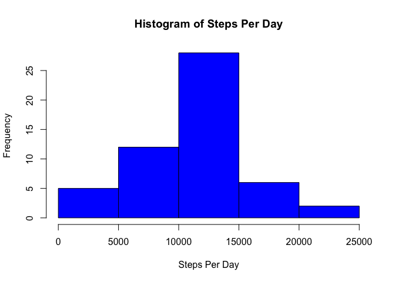
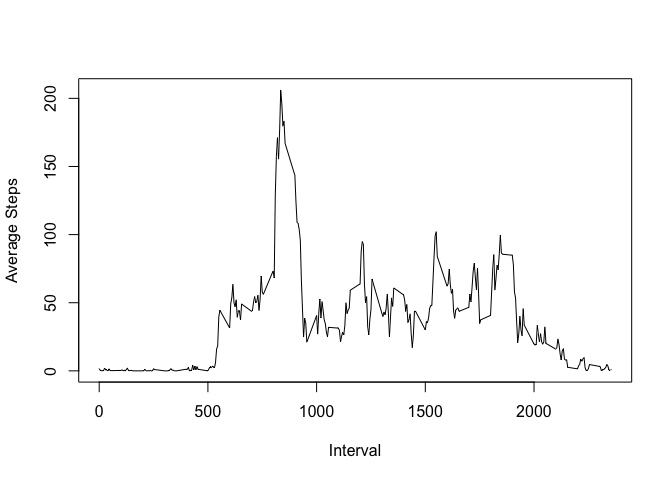
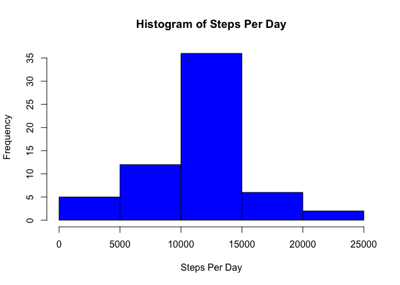
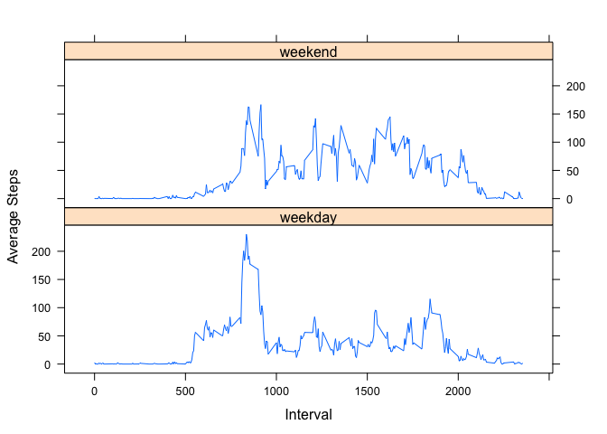

# Reproducible Research: Peer Assessment 1
##Loading and preprocessing the data

First, I set me working directory and upload the csv file to R stored as 'data'


```r
setwd("~/Documents/Coursera/RepData_PeerAssessment1")
data <- read.csv("activity.csv", header = TRUE)
```
##What is mean total number of steps taken per day?

For this step I first had to remove the missing data. I stored this value to a new data frame called 'clean'

For ease of writting I seperated Steps, Date, and Interval into their own objects 


```r
clean<- na.omit(data)
steps <- clean$steps
date <- clean$date
interval <- clean$interval
```

To find the total number of steps per day, I used the tapply function to sum the number of steps across each day 

```r
steps_per_day<-tapply(steps, date, sum)
steps_per_day
```

```
## 2012-10-01 2012-10-02 2012-10-03 2012-10-04 2012-10-05 2012-10-06 
##         NA        126      11352      12116      13294      15420 
## 2012-10-07 2012-10-08 2012-10-09 2012-10-10 2012-10-11 2012-10-12 
##      11015         NA      12811       9900      10304      17382 
## 2012-10-13 2012-10-14 2012-10-15 2012-10-16 2012-10-17 2012-10-18 
##      12426      15098      10139      15084      13452      10056 
## 2012-10-19 2012-10-20 2012-10-21 2012-10-22 2012-10-23 2012-10-24 
##      11829      10395       8821      13460       8918       8355 
## 2012-10-25 2012-10-26 2012-10-27 2012-10-28 2012-10-29 2012-10-30 
##       2492       6778      10119      11458       5018       9819 
## 2012-10-31 2012-11-01 2012-11-02 2012-11-03 2012-11-04 2012-11-05 
##      15414         NA      10600      10571         NA      10439 
## 2012-11-06 2012-11-07 2012-11-08 2012-11-09 2012-11-10 2012-11-11 
##       8334      12883       3219         NA         NA      12608 
## 2012-11-12 2012-11-13 2012-11-14 2012-11-15 2012-11-16 2012-11-17 
##      10765       7336         NA         41       5441      14339 
## 2012-11-18 2012-11-19 2012-11-20 2012-11-21 2012-11-22 2012-11-23 
##      15110       8841       4472      12787      20427      21194 
## 2012-11-24 2012-11-25 2012-11-26 2012-11-27 2012-11-28 2012-11-29 
##      14478      11834      11162      13646      10183       7047 
## 2012-11-30 
##         NA
```

To make a Histrogram of the total steps per day, I used the hist function in the base package.

```r
hist(steps_per_day, xlab = "Steps Per Day", main = "Histogram of Steps Per Day", col = "blue")
```

 

To find the mean and median steps per day, I moved the steps per day to a data and removed the NA values  


```r
spddf <- data.frame(steps_per_day)
clean_spddf <- na.omit(spddf)
```

Then I could run the mean and median function to find the mean and median 

```r
mean(clean_spddf$steps_per_day)
```

```
## [1] 10766.19
```

```r
median(clean_spddf$steps_per_day)
```

```
## [1] 10765
```

##What is the average daily activity pattern?

To find the daily steps taken per interval averaged across all the days, I ran tapply and stored the result as steps_per_interval.  
I then combined the steps_per_interval object and the list of intervals into a data frame(z).  
I then used the base plot system to plot the data.


```r
steps_per_interval <- tapply(steps, interval, mean)
z <- cbind(unique(interval), steps_per_interval)

plot(z, type ="l", ylab = "Average Steps", xlab = "Interval")
```

 

To find the interval that has the maximum average number of steps, I took a subset that returns the interval column (the first column in my data frame), and the row that equals the max value of column 2 in my data frame (the number of steps). 


```r
z[(z[,2] == max(z[,2])),1]
```

```
## [1] 835
```
I found the max interval minute to be 835 on average. 

##Imputing missing values

To find the number of rows that have missing values, I returned to the original data set, data.  
I take a subset the uses is.na to create a data frame that only has rows contain missing values.  
I then can take the nrow of the data frame to find the number of rows


```r
na <- data[(is.na(data)),]
nrow(na)
```

```
## [1] 2304
```

I found there to be 2,304 rows with missing values. 

To replace the NA value with the daily mean, I ran a for loop which checks if there is a missing steps value. If there is a NA value then the forumla stores the interval of the NA as 'x', uses 'x' to find the average interval mean in my 'z' data set from before and stores it as 'y'. To not write over my orginal data I store 'y' into a list, step2. 

I then constructed a data set with the new step values (steps2) called data2. 


```r
steps2 <- c()
for (i in 1:17568){
        if (is.na(data[i,1])){
                x<- data[i,3]
                y<- z[(z[,1] == x),2]
        } else { y <- data[i,1]}
        steps2 <- c(steps2,y)
}
data2 <- cbind(steps2, as.character(data[,2]),data[,3])
data2 <- data.frame(data2)
colnames(data2) <- c("steps", "date", "interval")

data2$steps <- as.numeric(as.character(data2$steps))
data2$interval <- as.integer(as.character(data2$interval))
data2$date<- as.Date(data2$date, format = "%Y-%m-%d")

date2 <- data2[,2]

steps_per_day2 <- tapply(steps2, date2, sum)
hist(steps_per_day2, xlab = "Steps Per Day", main = "Histogram of Steps Per Day", col = "blue")
```

 

As one would expect, adding more values along the mean, pushes the median to the mean, and keeps the mean the same.  


```r
mean(steps_per_day2)
```

```
## [1] 10766.19
```

```r
median(steps_per_day2)
```

```
## [1] 10766.19
```

##Are there differences in activity patterns between weekdays and weekends?

To find whether a day is a weekday or weekend I used the weekdays function as well as the factor function.  

I first created a variable called weekday which contains all the weekday days. I used %in% to apply a logical test. I then specified the levels and labels. I stored this function back into my data2 data set. 


```r
weekday <- c("Monday", "Tuesday", "Wednesday", "Thursday", "Friday")
data2$day_of_week <-  factor((weekdays(date2) %in% weekday)+1L, levels=1:2, labels=c('weekend', 'weekday'))
```

Now that the data is in one place 


```r
 weekdays <- data2[(data2$day_of_week == "weekday"),]
 weekend <- data2[(data2$day_of_week == "weekend"),]

weekday_steps <- weekdays[,1]
weekday_interval <- weekdays[,3]
weekday_average <- tapply(weekday_steps, weekday_interval, mean)
wd_average <- data.frame(weekday_average)
day_df <- data.frame(cbind(wd_average, unique(interval), rep("weekday",288)))
colnames(day_df) <- c("average_steps", "interval", "day_of_week")


weekend_steps <- weekend[,1]
weekend_interval <- weekend[,3]
weekend_average <- tapply(weekend_steps, weekend_interval, mean)
we_average <- data.frame(weekend_average)
end_df <- data.frame(cbind(we_average, unique(interval), rep("weekend",288)))
colnames(end_df) <- c("average_steps", "interval", "day_of_week")

data3 <- rbind(day_df, end_df)
```

Finally, the plot of the Weekday averages and Weekend averages.

```r
library(lattice)
```

```
## Warning: package 'lattice' was built under R version 3.1.3
```

```r
xyplot(data3$average_steps~data3$interval| data3$day_of_week, layout = c(1,2), type= "l", xlab= "Interval", ylab="Average Steps")
```

 

